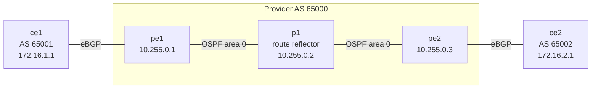
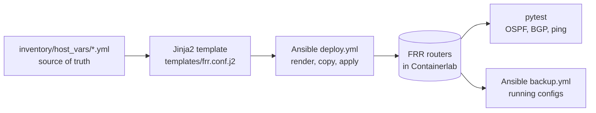
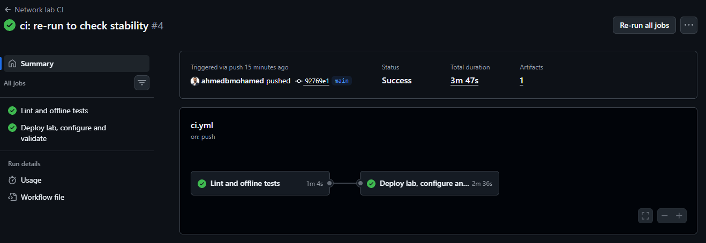
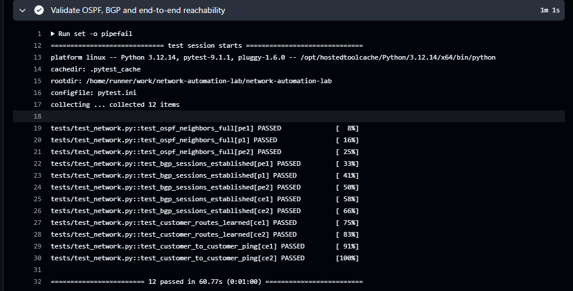

# network-automation-lab

[](https://github.com/ahmedbmohamed/network-automation-lab/actions/workflows/ci.yml)

A small **carrier backbone** built as code: routers run in containers, **Ansible** configures them from a
**YAML source of truth**, and **pytest** checks that the network really works (OSPF, BGP and end-to-end
traffic). **GitHub Actions** builds the whole lab from scratch, configures it and tests it on every push.

**Stack:** Containerlab · FRRouting · Ansible · Jinja2 · Python (pytest) · GitHub Actions

## Topology



| Link | Subnet | Protocol |
|---|---|---|
| ce1 – pe1 | 192.168.1.0/30 | eBGP (AS 65001 ↔ 65000) |
| pe1 – p1 | 10.0.12.0/30 | OSPF area 0 (point-to-point) |
| p1 – pe2 | 10.0.23.0/30 | OSPF area 0 (point-to-point) |
| pe2 – ce2 | 192.168.2.0/30 | eBGP (AS 65002 ↔ 65000) |

- **OSPF** carries the provider loopbacks; **iBGP** runs between loopbacks with **p1 as route reflector** and
  **next-hop-self** on the PEs.
- Each customer announces its LAN (loopback) and learns the other customer's LAN through the provider.

## How it works



1. **Source of truth:** every router is described in `inventory/host_vars/<router>.yml` (interfaces, OSPF, BGP).
2. **Templating:** `templates/frr.conf.j2` turns that data into a full FRR configuration.
3. **Deployment:** `playbooks/deploy.yml` copies the config into each container and applies only the
   differences with `frr-reload.py`. Running it twice changes nothing (idempotent).
4. **Validation:** `tests/test_network.py` reads the same YAML files and checks that every OSPF neighbour is
   `Full`, every BGP session is `Established`, each customer learns the other's prefix, and a ping between
   customer LANs crosses the backbone.
5. **Backup:** `playbooks/backup.yml` saves each router's running configuration to `backups/`.

Because the tests are computed from the source of truth, adding a router or a BGP neighbour in YAML
automatically adds the matching checks.

## CI pipeline

On every push and pull request, `.github/workflows/ci.yml` runs two jobs:

| Job | What it does |
|---|---|
| **Lint and offline tests** | `yamllint`, Ansible syntax check, and template tests that render every config and check addressing and BGP symmetry without Docker |
| **Deploy lab, configure and validate** | installs Containerlab, deploys the 5 routers, runs the Ansible deployment twice (idempotency check), runs the network tests, prints OSPF/BGP state, backs up the configs as a build artifact, and destroys the lab |

A pull request that breaks the design (wrong subnet, missing BGP neighbour, OSPF area mismatch) fails the
pipeline before it reaches `main`.



The live network tests check OSPF neighbours, BGP sessions, learned customer routes and end-to-end ping (12 checks, all passing):



## Run it yourself

Requirements: Linux or WSL2 with Docker, Python 3.10+.

```bash
# Tools
pip install -r requirements.txt
ansible-galaxy collection install -r requirements.yml
bash -c "$(curl -sL https://get.containerlab.dev)"

# Build, configure and test the lab
sudo containerlab deploy -t clab/topology.clab.yml
ansible-playbook playbooks/deploy.yml
pytest -v

# Look around
docker exec -it clab-netlab-pe1 vtysh -c "show ip bgp"
docker exec -it clab-netlab-ce1 ping -I 172.16.1.1 172.16.2.1

# Save configs and clean up
ansible-playbook playbooks/backup.yml
sudo containerlab destroy -t clab/topology.clab.yml --cleanup
```

## Repository layout

```
clab/topology.clab.yml      Containerlab topology (5 FRR routers)
inventory/hosts.yml         Ansible inventory and groups
inventory/host_vars/        Source of truth: one YAML file per router
templates/frr.conf.j2       FRR configuration template
playbooks/deploy.yml        Render, copy and apply configurations
playbooks/backup.yml        Save running configurations
tests/test_templates.py     Offline checks of rendered configs and data
tests/test_network.py       Live checks: OSPF, BGP, routes, ping
.github/workflows/ci.yml    CI: lint, deploy, validate, back up
```

## Related work

- [devsecops-gitops-lab](https://github.com/ahmedbmohamed/devsecops-gitops-lab): CI with a Trivy security
  gate, Helm and ArgoCD on Kubernetes.
- This lab automates the routing design of my engineering-school IP/MPLS backbone project
  (OSPF, MP-BGP, MPLS) that I first built by hand in GNS3.
